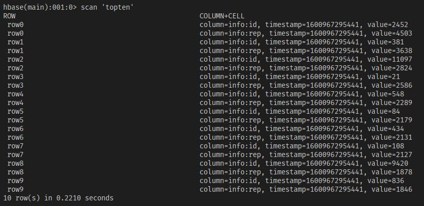

# TopTen Hadoop and HBase Assignment

In this exercise, the aim is to read a record of users from an XML file stored in HDFS, execute a MapReduce job that calculates
the top ten users in the list with more reputation and store the output in an HBase table.

## Code description
### Configuration
First of all, in the driver class, the Hadoop configuration with HBase resources is created. After this, we create a new Job 
with no particular Cluster, a given configuration and a jobName "Top ten", setting TopTen class as jar class to submit the job 
to the Resource Manager.

### Map Stage
In order to specify the input to the map class, we made use of FileInputFormat. This class validates the input-specification of the job and splits up input files into logical splits that would be assigned to an individual mapper. In this case, as the file size is lower than 128MB,
there will only be one split.

Once the input is specified we set the Mapper for the job, its output key class and value class (matching the output types from TopTenMapper class).

The mapper class receives the data from the users.xml, parses it and stores it into a local HashMap the properties 'id' and 'reputation' of each valid user.
We decided to use HashMap instead of the proposed TreeMap to avoid the extra computation of sorting the results by the property 'id', as in this case it is not required, only the column reputation should be sorted eventually. If instead of id, reputation added as the key for TreeMap, the sorting would already be done, however, two users that have the same reputation would not appear in the results, as TreeMap keys must be unique.

In order to output the records from the mapper in a serializable way, we added the user id separated by a dash to the user reputation, 
resulting in texts like '<key>-<reputation>'. This allows us to send texts to the reducer more efficiently and not the Map object.

### Reduce Stage
First, as proposed in the assignment description, we are setting to one the number of reduce tasks for this job with the 'setNumReduceTasks' method. 
This is done to avoid distributing our input into multiple reducers and having different top-ten results. Instead, we do everything in
one cluster and one reducer. Then, the HBase dependency jars as well as jars for any of the configured job classes are added to the job configuration, so the job can ship them to the cluster. Finally, we use TableMapReduceUtil to specify to the reducer that the output should be to an HBase Table.

Inside the reducer, we just iterated over the records received, parsing them back and inserting them into the HBase table as speicfied in the assignment.
```scala
// Create a row and insert two columns, one with the value of the user id and other one with user reputation
Put outputTableRow = new Put(outputTableRowName.getBytes());
outputTableRow.addColumn(Bytes.toBytes(COLUMN_FAMILY), Bytes.toBytes("id"), Bytes.toBytes(userRecordParsed[0]));
outputTableRow.addColumn(Bytes.toBytes(COLUMN_FAMILY), Bytes.toBytes("rep"), Bytes.toBytes(userRecordParsed[1]));
context.write(NullWritable.get(), outputTableRow);
```

## Arguments

In order to compile the program the commands needed are

- Start necessary services
```
$HADOOP_HOME/bin/hdfs --daemon start namenode
$HADOOP_HOME/bin/hdfs --daemon start datanode
$HBASE_HOME/bin/start-hbase.sh
```
- Create the HBase table topten with one column family info to store the id and reputation of users.
```
$HBASE_HOME/bin/hbase shell
[Inside hbase shell] create ’topten’, ’info’
```
- Set necessary environment variables
```
export HADOOP_CLASSPATH=$($HADOOP_HOME/bin/hadoop classpath)
export HBASE_CLASSPATH=$($HBASE_HOME/bin/hbase classpath)
export HADOOP_CLASSPATH=$HADOOP_CLASSPATH:$HBASE_CLASSPATH
```
- Compile the program
```
javac -cp $HADOOP_CLASSPATH -d output src/main/java/TopTen.java
```

- Generate the jar using the files in the previous compiled folder
```
jar -cvf topten.jar -C output .
```

- Execute the program passing as first argument the hdfs path where users.xml is and the HBase table name:
```
$HADOOP_HOME/bin/hadoop jar topten.jar TopTen <HDFS_PATH>/users.xml topten
```

## Outcome
After runnning the program and scanning the table topten the results are the following


## Authors
- Serghei Socolovschi [serghei@kth.se](mailto:serghei@kth.se)
- Angel Igareta [alih2@kth.se](mailto:alih2@kth.se)
